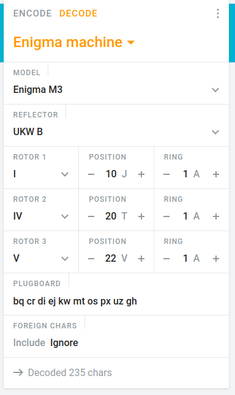

# Cryptography 02
```bash
IP=192.168.10.5
```

the title is "enigma machine" the content is just a template

## gobuster
not helpfull
```bash
$ gobuster dir -u http://$IP -w /usr/share/wordlists/dirb/common.txt
===============================================================
Gobuster v3.1.0
by OJ Reeves (@TheColonial) & Christian Mehlmauer (@firefart)
===============================================================
[+] Url:                     http://192.168.10.5
[+] Method:                  GET
[+] Threads:                 10
[+] Wordlist:                /usr/share/wordlists/dirb/common.txt
[+] Negative Status codes:   404
[+] User Agent:              gobuster/3.1.0
[+] Timeout:                 10s
===============================================================
2022/06/09 02:13:00 Starting gobuster in directory enumeration mode
===============================================================
/assets               (Status: 301) [Size: 0] [--> /assets/]
/index.html           (Status: 200) [Size: 15611]           
/sample               (Status: 301) [Size: 0] [--> /sample/]
                                                            
===============================================================
2022/06/09 02:13:34 Finished
===============================================================
```

## curl
the website sets an unusual X-Frame-Options:
```bash
$ curl -I http://$IP                                                
HTTP/1.1 200 OK
Server: nginx/1.18.0
Date: Thu, 09 Jun 2022 00:14:18 GMT
Content-Type: text/html
Content-Length: 15611
Connection: keep-alive
Last-Modified: Sat, 21 May 2022 11:14:11 GMT
X-Frame-Options: M3 (model3) | B (reflector type) | I,IV,V (rotor types and order) | J,T,V (rotors initial value) | 1,1,1 (rotors ring setting)
```

the values correspond to enigma settings [online](https://cryptii.com/pipes/enigma-machine), but what is the input, what is the plugboard?



the `main.js` has a `console.log` at the end:

```js

console.log("KPVBP DQRCI NYKWT JQTVY EUMUD YFZEN FXAMO ZECT");

```

used as the input, the result is
```
thefl agisj fkjru iawxm vdzwy gkncm ltgkj dxse
the flag is jfkjruiawxmvdzwygkncmltgkjdxse

JFKJRUIAWXMVDZWYGKNCMLTGKJDXSE

```

`cyberctfd{JFKJRUIAWXMVDZWYGKNCMLTGKJDXSE}`