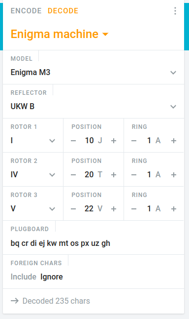

# Cryptography 03
```bash
IP=192.168.10.5
```

When opening the website corresponding to our IP, we realise that the title is "enigma machine" and the content is just a template.

## curl
the website sets an unusual X-Frame-Options:
```bash
$ curl -I http://$IP                                                
HTTP/1.1 200 OK
Server: nginx/1.18.0
Date: Thu, 09 Jun 2022 00:14:18 GMT
Content-Type: text/html
Content-Length: 15611
Connection: keep-alive
Last-Modified: Sat, 21 May 2022 11:14:11 GMT
X-Frame-Options: M3 (model3) | B (reflector type) | I,IV,V (rotor types and order) | J,T,V (rotors initial value) | 1,1,1 (rotors ring setting)
```

The values of the X-Fram-Options corresponds to enigma settings, so we set them in an online enigma decoder:

[online](https://cryptii.com/pipes/enigma-machine)



Afterwards, inspecting the page, we found out that the console of the page has a code which could match with the input of our machine. This 'console.log()' is at the very end of the `main.js`.

```js

console.log("KPVBP DQRCI NYKWT JQTVY EUMUD YFZEN FXAMO ZECT");

```

used as the input, the result is
```
thefl agisj fkjru iawxm vdzwy gkncm ltgkj dxse
the flag is jfkjruiawxmvdzwygkncmltgkjdxse

JFKJRUIAWXMVDZWYGKNCMLTGKJDXSE

```

Flag: `cyberctfd{JFKJRUIAWXMVDZWYGKNCMLTGKJDXSE}`
